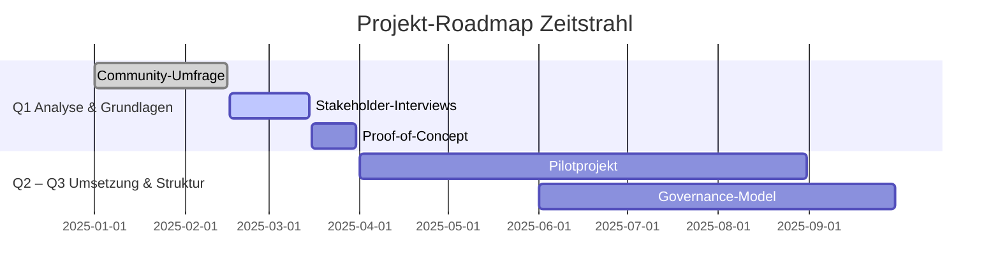

---
# 📍 Projekt-Roadmap

## ✅ Q1: Analyse & Grundlagen
- [ ] **Community-Umfrage**  
  Erhebung bei Cloud-Architekten und DevOps-Teams zur Quantifizierung der identifizierten Probleme
- [ ] **Stakeholder-Interviews**  
  Tiefeninterviews mit CTOs und CISOs regulierter Branchen (Gesundheitswesen, Finanzsektor) zu Souveränitätsanforderungen
- [ ] **Proof-of-Concept**  
  Entwicklung eines Minimal Viable Framework für eine einzelne Säule  
  *(z. B. Security-Patterns für Kubernetes über AWS/Azure/GCP)*

---

## 🚀 Q2 – Q3: Umsetzung & Struktur
- [ ] **Pilotprojekt**  
  Erprobung des Baustein-Ansatzes in einem realen Multi-Cloud-Szenario mit messbaren KPIs
- [ ] **Governance-Model**  
  Finalisieren der Definition von Community-Strukturen und Maintenance-Prozessen
